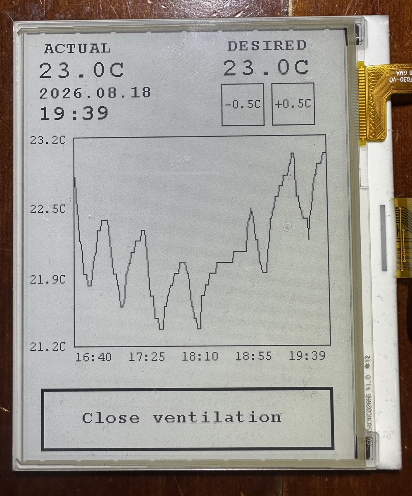
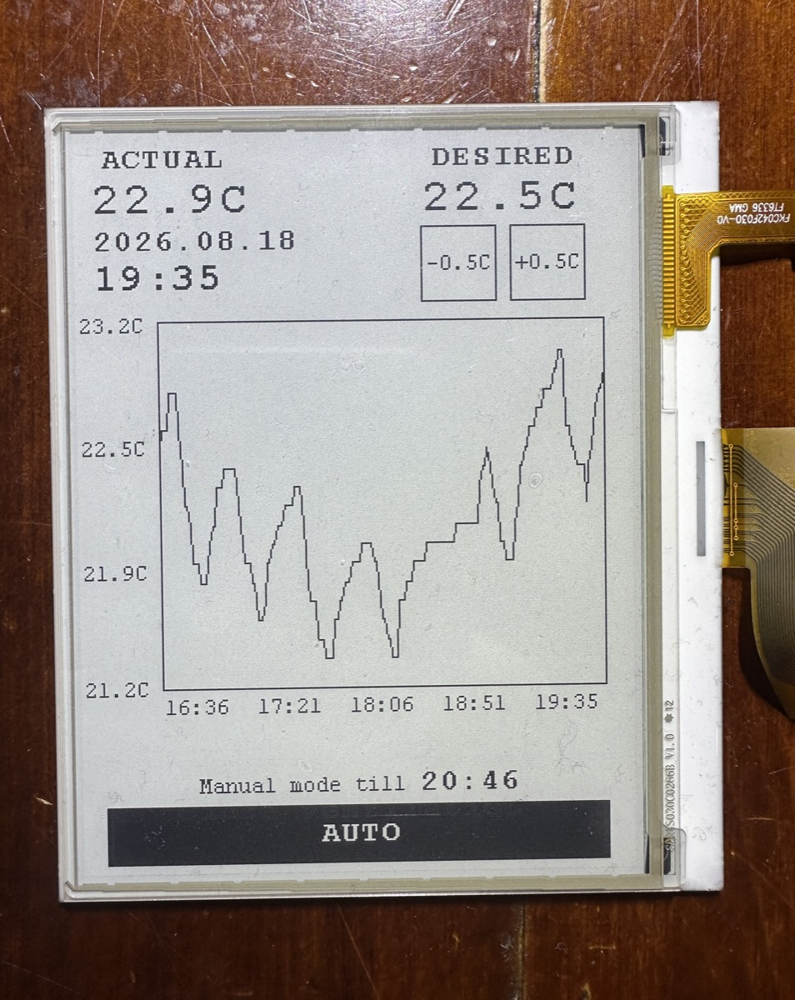

# Device — In-Room User-Facing Mesh Node

This directory holds the design intent, prep work, procurement notes, and
working-prototype progress for the **EFW Device** — the third node type
in the Energy Flow Wall mesh, alongside the Gateway (RP5 + NeoGW) and the
Actuator (flap motors).

**Status:** custom PCB not yet designed (all schematic decisions are
locked at the architectural level, PCB layout is the next step), but a
working touchscreen dashboard is already running end-to-end on an
STM32U5 Nucleo dev board over the real mesh — see below.

## Working prototype

| Auto mode | Manual override |
|---|---|
|  |  |
| Valve following its normal schedule — tall **"Close ventilation"** button offers to override it. | A manual override active (here, from a DESIRED nudge) — short **"AUTO"** button, with the till-time shown, cancels it. |

A 4.2" e-paper touchscreen (GDEY042T81, FT6336U touch) on an STM32U5
Nucleo, talking to the mesh over a NeoCortec NC1000 radio. In-room
display + manual override panel for one valve zone — no phone or laptop
needed to see the current temperature or flip into manual mode.

**What it shows:**
- **ACTUAL** — the room's current temperature, live from the mesh.
- **DESIRED** — the target temperature; tap `-0.5C` / `+0.5C` to nudge it.
- **Date / time** — synced live, every ~30s.
- **Chart** — a live temperature history kept on-device: tap the top of
  the chart to zoom out (3h → 6h → 12h → 24h → 48h → 7d), the bottom to
  zoom back in, and the left/right halves to scroll back/forward in time.
- **Valve button** — the black bar along the bottom, showing either
  "Close ventilation" (Auto mode) or "AUTO" + a manual-override till-time.

Firmware source, build/flash instructions, and a fuller writeup live in
the private code repo (see below) — this directory is progress notes and
photos only.

## What the Device is

A battery-powered in-room sensor and user-interface node:

- 4.2" 400×300 monochrome e-paper with bonded capacitive touch overlay (GoodDisplay GDEY042T81-T02 + FT6336U)
- STM32U585 (ARM Cortex-M33 @ 160 MHz, 2 MB flash)
- NeoCortec NC1000 sub-GHz mesh + Bluetooth Low Energy
- Modular sensor population per install: temperature / humidity always (Sensirion SHT45), CO₂ optional (Sensirion SCD41), human presence optional (Infineon BGT60LTR11AIP 60 GHz radar), 2 in / 2 out potential-free I/O optional
- LiFePO₄ pouch battery (LFP143060, 1800 mAh) with MagSafe wireless charging (TI BQ51013B)
- Optional accessory: small solar panel + TI BQ25570 MPPT energy harvester

The Device replaces the retired 0x33 / 0x44 NC1000-only test-only T/H sniffers.

## Files in this directory

| File | What's in it |
|---|---|
| [Brief.md](Brief.md) | Architectural decisions — display, power, sensors / I/O, mesh integration, all locked component choices and the rationale. **Read this first.** |
| [Schematic_placeholder.md](Schematic_placeholder.md) | Authoritative-schematic file (placeholder until hardware exists). |
| [HW_Prep.md](HW_Prep.md) | Toolchain setup, reading order for the datasheets, and the firmware skeleton work that can be done without hardware in hand. |
| [Procurement.md](Procurement.md) | Tiered dev-kit shopping list with prices and rationale. |
| [Doc_Gaps.md](Doc_Gaps.md) | Datasheet gaps still to grab + TBD part choices that block the schematic. |
| [Datasheet_Stash.md](Datasheet_Stash.md) | Pointer to the local datasheet stash (path is on the author's machine; the third-party PDFs themselves are not in this repo). |
| [LFP_Pouch_Sources.md](LFP_Pouch_Sources.md) | Verified LFP pouch cell suppliers for the Device battery. |
| [Sniffer_Concept.md](Sniffer_Concept.md) | Exploratory concept for a future mains-powered premium air-quality variant on the same mesh. Not yet committed. |
| `scripts/grab_datasheets.py` | Idempotent downloader for the Device datasheets. |
| `scripts/DOWNLOADS_TODO.md` | List of files that need to be downloaded manually (gated PDFs, login walls, CDN-fighting-curl, etc.). |
| [`Docs/02_Display_Touch/READ_FIRST.md`](Docs/02_Display_Touch/READ_FIRST.md) | Porting strategy for the GoodDisplay GDEY042T81-T02 reference firmware (STM32F103) to the STM32U585 production target. |
| `Docs/DOWNLOADS_TODO.html` | HTML rendering of `scripts/DOWNLOADS_TODO.md`. |

The `Docs/` subdirectory holds annotations about external reference materials kept locally; the third-party datasheets and vendor sample-code archives themselves are not in this repo for licensing and repo-size reasons.

## Sibling content in this repo

- [`../Actuator/KiCad/Main_PCB_Based_on_8411A/`](../Actuator/KiCad/Main_PCB_Based_on_8411A/) — the Actuator KiCad design (sibling node, useful reference).
- [`../Docs/`](../Docs/) — system-level documentation (SYSTEM_REFERENCE, EFW_Functional_Requirements, etc.).
- [Energy_Flow_Wall_Code](https://github.com/ajanulis/Energy_Flow_Wall_Code) — private firmware + scripts repo; Device firmware (build/flash instructions, full technical writeup) lives there under `firmware/device/epaper_bringup/`.
